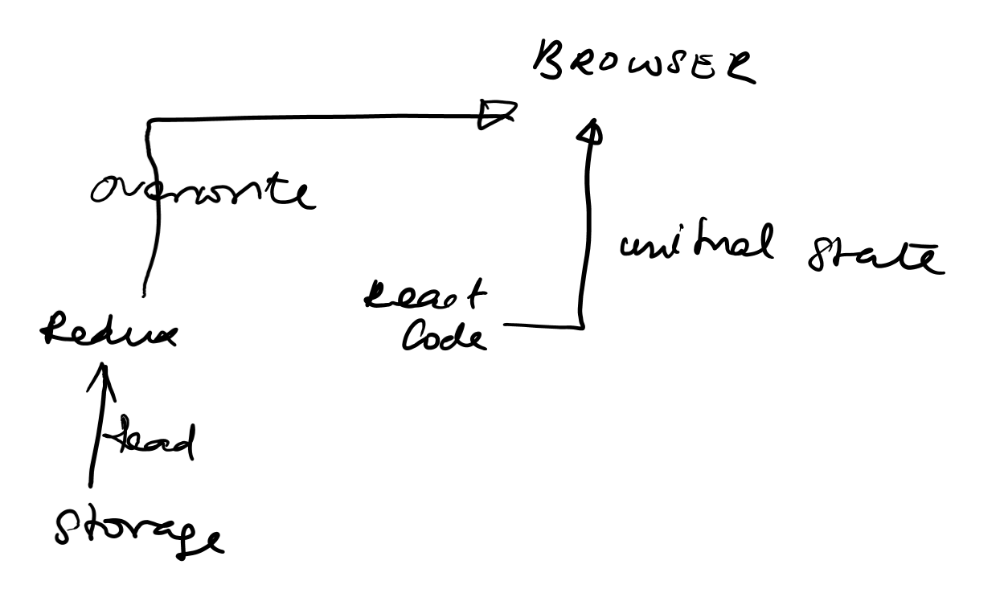

How does redux pesist work ?

Typically react applications handle the following types of data:
- Business Data ( Either hard code or obtained from fetch processes from a backend API)
- User interaction data (button clicked)
- Authorization / Authentication data (userID - fetched from the Authentication provider after logging in)

Unless persistance is setup, the browser loses all data when the tab is closed. Imagine logging into amazon and putting things into cart, and then you accidentally close the page. Boom !! You loose all data and then you have to start selecting all the products again from start.
To avoid this and to keep the user loggedIn until the browser itself is closed, persistance can be setup. 

Fortunately, to setup persistance, react has redux-persist. A module meant to solve persistance.
redux-persist stores a part of the state you specify in the specified location.

## Setup
1. Install using 'npm install --save redux-persist'
2. Import persistStore, persistReducer from 'redux-persist'
3. create a config object like so:
    ```javascript
    const persistConfig = {
    key: 'root',
    storage: storage,
    stateReconciler: autoMergeLevel2
    };
    ```
4. include the config object with Store like so:
   ```javascript
   const pReducer = persistReducer(persistConfig, rootReducer);
   ```
   This will create an object with two keys : config, and baseReducer pointing to the values you supplied.
5. now create store and persistore by passing pReducer to createStore and then persistore
    ```javascript
    export const store = createStore(pReducer);
    export const persistor = persistStore(store); 
    ```
    note that both the values are exported. Because we will be using them both in the App.js file
6. Without persistance, the \<App> Component would have been wrapped around \<Provider>. With persistance we need to wrap the app around \<PersistGate> like so:
   ```javascript
    const App = () => {
        return (
            <Provider store={store}>
            // the loading and persistor props are both required!
            <PersistGate loading={<LoadingView />} persistor={persistor}>
                <RootComponent />
            </PersistGate>
            </Provider>
        );
    };
   ```


## Understanding the config
This is how a config object looks like :

```javascript
const persistConfig = {

    key: string, // the key for the persist
    storage: Object, // the storage adapter, following the AsyncStorage api
    version?: number, // the state version as an integer (defaults to -1)
    blacklist?: Array<string>, // do not persist these keys
    whitelist?: Array<string>, // only persist these keys
    migrate?: (Object, number) => Promise<Object>,
    transforms?: Array<Transform>,
    throttle?: number, // ms to throttle state writes
    keyPrefix?: string, // will be prefixed to the storage key
    debug?: boolean, // true -> verbose logs
    stateReconciler?: false | StateReconciler, // false -> do not automatically reconcile state
    serialize?: boolean, // false -> do not call JSON.parse & stringify when setting & getting from storage
    writeFailHandler?: Function, // will be called if the storage engine fails during setItem()

};
```

Only the ones without ? is required.
- The key points to the reducer that you are trying to perist. Hence:
  -  if you are going to persist the rootReducer as a whole: key : root
  -  the direct child of rootreducer key: root, whitelist:['child key as in combine reducer'] 
  -  grandchild of rootreducer i.e: a key within the state of a reducer. key : root, key: child whitelist:[its child to whitelist]. In this case you would need to write a separate config and wrap the reducer around persistReducer function. It is preferable to do this where you combine reducers since you can write all persist Configs at the same place.
  
- storage: \Needs input
- stateReconciler: \whether to merge with inital state.
- blacklist - do not save this
- whitelist - perist these

## TL DR
```javascript
/// at store
const persistConfig = {
 key: 'root',
 storage: storage,
 stateReconciler: autoMergeLevel2 // see "Merge Process" section for details.
};

const pReducer = persistReducer(persistConfig, rootReducer);

export const store = createStore(pReducer);
export const persistor = persistStore(store);

///At app 
const App = () => {
  return (
    <Provider store={store}>
      // the loading and persistor props are both required!
      <PersistGate loading={<LoadingView />} persistor={persistor}>
        <RootComponent />
      </PersistGate>
    </Provider>
  );
};
```

## Working


Depends on the value provided for stateReconciler key. 
if it is "harSet", then the entrire state will be wiped out and the storage will be written. Keys that are blacklisted will be lost from the intital value.

if it is "autoMergeLevel1", then the keys that are not in the storage but found in intial state would be left as such

if it is "autoMergeLevel2", then just same as above but goes one level further down and check the grand child's keys as well. This is the most safer option.

### Article Based on these articles. Credits:
- https://blog.reactnativecoach.com/the-definitive-guide-to-redux-persist-84738167975
- https://github.com/rt2zz/redux-persist/blob/master/docs/api.md
- https://github.com/rt2zz/redux-persist

<!-- <iframe width="560" height="315" src="https://www.youtube.com/embed/DXJO3AraeMQ" frameborder="0" allow="accelerometer; autoplay; encrypted-media; gyroscope; picture-in-picture" allowfullscreen></iframe> -->
